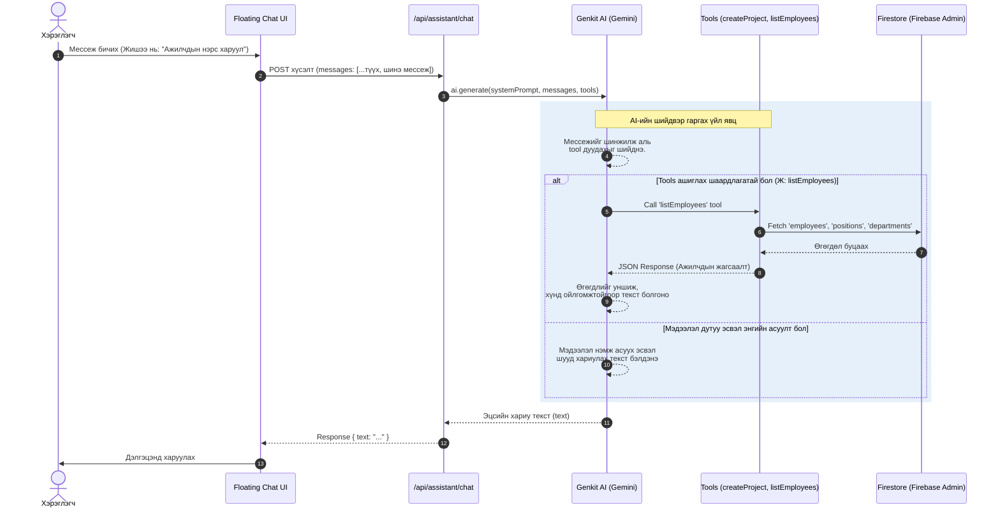

# AI Туслах Функцийн Логик

Энэхүү баримт нь Nege Systems-д суурилагдсан AI туслахын ажиллах логик болон өгөгдлийн урсгалыг харуулна.

## Архитектурын урсгал (Sequence Diagram)

## Логикийн тайлбар

1. **Frontend (Floating Chat UI):** Хэрэглэгчтэй шууд харилцаж, мессежийн түүхийг хадгалж API руу илгээнэ.
2. **API Route (`/api/assistant/chat`):** Мессежийн түүхийг хүлээн авч `Genkit`-д дамжуулна. Энд бид AI-д `maxTurns: 5` гэж зааж өгсөн тул AI өөрөө цаанаа tool дуудаад, хариуг нь аваад дахин боловсруулж эцсийн хариугаа гаргах боломжтой.
3. **Genkit AI (Gemini 2.5 Flash):** Системийн промпт уншиж, хэрэглэгчийн асуултад дүн шинжилгээ хийнэ. Хэрэв шууд хариулах боломжгүй (жишээ нь: мэдээлэл дутуу) бол нэмж асууна. Харин үйлдэл хийх шаардлагатай бол зохих хэрэгслийг (tool) дуудна.
4. **Tools (`listEmployees`, `createProject`):** AI-ийн зүгээс дуудагдах бөгөөд сервер талдаа Firebase Admin SDK ашиглан Firestore мэдээллийн сантай шууд харилцаж, аюулгүй байдлаар унших/бичих үйлдлүүдийг гүйцэтгэнэ.
5. **Үр дүн буцаах:** AI-аас гарсан эцсийн хариуг буцааж хэрэглэгчийн дэлгэцэнд хэвлэнэ.